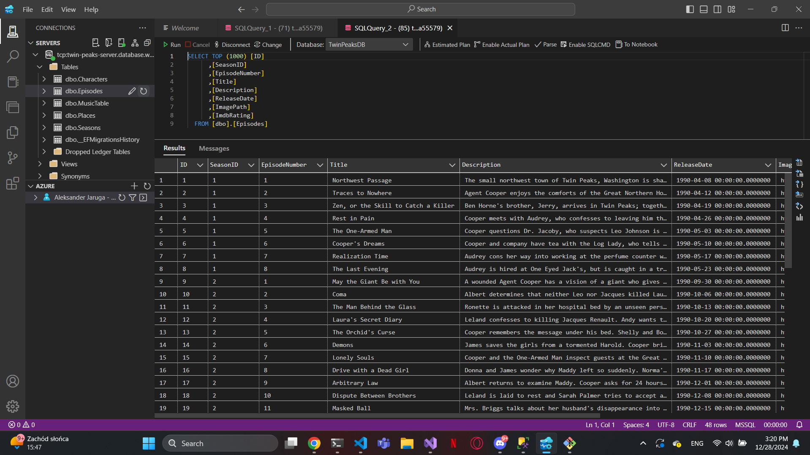

# MojeTwinPeaks

MojeTwinPeaks to aplikacja, która umożliwia zarządzanie danymi dotyczącymi serialu "Twin Peaks". Projekt koncentruje się na zarządzaniu odcinkami (episodes) oraz postaciami (characters) poprzez backend oparty na ASP.NET Core oraz infrastrukturę hostowaną w Microsoft Azure. Dodatkowo, aplikacja wykorzystuje Swaggera do dokumentacji API.

## Funkcjonalności
- Przechowywanie informacji o odcinkach serialu (episodes).
- Przechowywanie danych dotyczących postaci (characters).
- Wyświetlanie danych z bazy danych (aplikacja nie obsługuje operacji CRUD).
- Hostowanie w chmurze Azure z bazą danych SQL.
- Dokumentacja API generowana za pomocą Swaggera.

## Technologie
- **Backend:** ASP.NET Core MVC
- **Frontend:** React (w trakcie implementacji)
- **Baza danych:** Azure SQL Database
- **Hostowanie:** Microsoft Azure
- **Dokumentacja:** Swagger

## Zrzuty ekranu

### 1. Rekordy z bazy danych odcinków


### 2. Rekordy z bazy danych postaci


### 3. Widok serwera w Azure


### 4. Widok bazy danych w Azure


### 5. Dokumentacja API w Swaggerze


## Jak uruchomić projekt

1. **Klonowanie repozytorium**
   ```bash
   git clone https://github.com/username/mojetwinpeaks.git
   cd mojetwinpeaks
   ```

2. **Konfiguracja środowiska**
   - Ustaw odpowiednie zmienne środowiskowe dla połączenia z bazą danych Azure.
   - Zainstaluj wymagane zależności za pomocą komendy:
     ```bash
     dotnet restore
     ```

3. **Uruchomienie aplikacji**
   ```bash
   dotnet run
   ```

4. **Dostęp do API**
   - Aplikacja będzie dostępna pod adresem `http://localhost:5000`.
   - Dokumentacja API dostępna pod `http://localhost:5000/swagger`.

## Wymagania systemowe
- .NET 6.0 lub nowszy
- Konto w Azure z odpowiednimi uprawnieniami do zarządzania bazami danych

## Autor
Aleksander Jaruga

## Licencja
Projekt udostępniony na licencji MIT.
